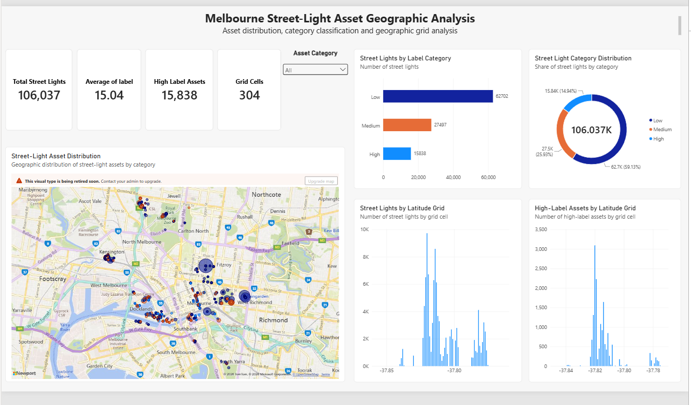

# Melbourne Street-Light Asset Geographic Analysis

Geospatial data analysis and interactive Power BI dashboard for analysing street-light assets across Melbourne.

## Data Source

Street-light asset data sourced from the City of Melbourne Open Data Portal.

## Dashboard Preview



## Project Overview

This project analyses Melbourne street-light assets using Python, Jupyter Notebook and Microsoft Power BI.

The project focuses on understanding asset distribution, asset label classification and geographic patterns across Melbourne.

### Key Analysis Areas

- Street-light asset distribution
- Asset label analysis
- Low, Medium and High asset categories
- Geographic asset distribution
- Grid-level analysis
- High-label asset concentration
- Interactive Power BI dashboard

## Key Results

| Metric | Result |
|---|---:|
| Total Street-Light Assets | 106,037 |
| Average Label | 15.04 |
| High-Label Assets | 15,838 |
| Geographic Grid Cells | 304 |
| Low-Category Assets | 62,702 |
| Medium-Category Assets | 27,497 |
| High-Category Assets | 15,838 |

### Category Distribution

| Category | Assets | Percentage |
|---|---:|---:|
| Low | 62,702 | 59.13% |
| Medium | 27,497 | 25.93% |
| High | 15,838 | 14.94% |

## Technologies Used

- Python
- Pandas
- NumPy
- Matplotlib
- Seaborn
- Jupyter Notebook
- Microsoft Power BI
- DAX
- Geospatial Analysis
- Data Visualisation

## Project Workflow

```text
Data Exploration
       ↓
Data Preparation
       ↓
Asset Label Analysis
       ↓
Category Classification
       ↓
Geographic Analysis
       ↓
Grid-Level Analysis
       ↓
Power BI Data Modelling
       ↓
Interactive Dashboard
